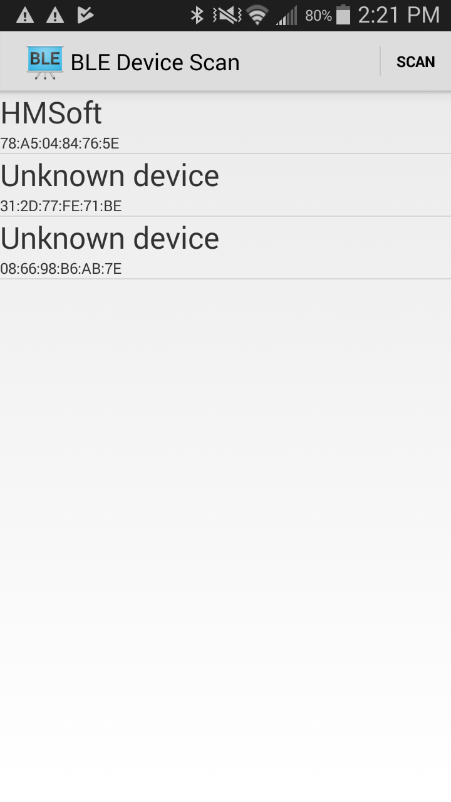
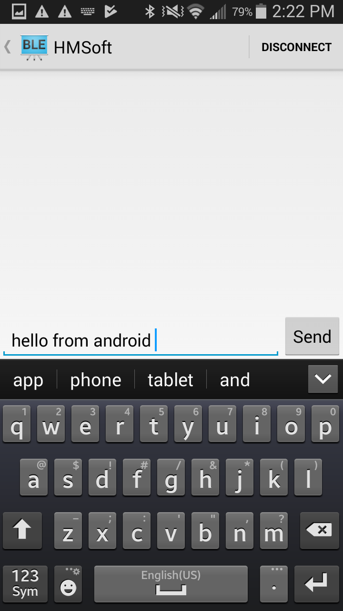
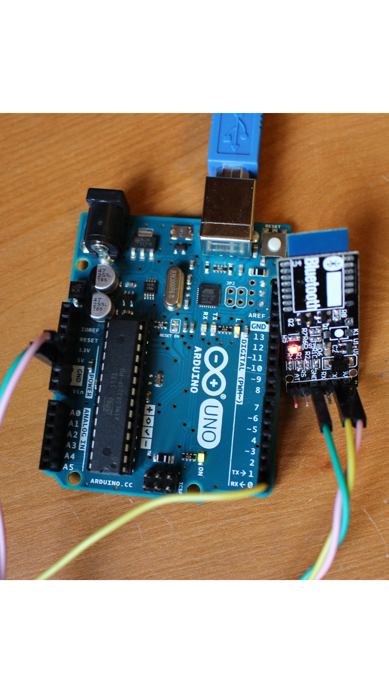

Android-BLE-to-Arduino
===================================

This code can be used to communicate with an Arduino and is based on sample code from Google and another githubber.

Google : http://developer.android.com/reference/android/app/Service.html

GitHub : https://developer.android.com/reference/android/bluetooth/BluetoothGatt.html

Introduction
------------

The easiest, least expensive way to add Bluetooth Low Energy communication capabilities to an Arduino is to use one of the HM-10 modules which are readily avaailable on Ebay.  These modules are great because they wrap all the BLE communication code in their firmware so on the Arudion side you're simply reading the serial port.  

Images
-------------

   

